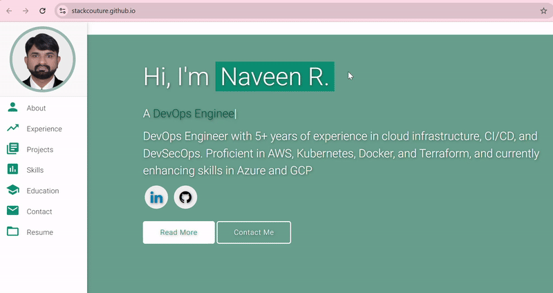

# Personal Portfolio ⚡️ 
> A clean, beautiful, responsive portfolio template for Software Developers!

> https://stackcouture.github.io/

### Website Preview

 
  <kbd>
    
  </kbd>

## Sections 📚
✔️ About me\
✔️ Experience\
✔️ Projects \
✔️ Skills \
✔️ Education\
✔️ Contact Info\
✔️ Resume

To view a live example, **[click here](https://stackcouture.github.io/)**

## License 📄
This project is licensed under the MIT License - see the [LICENSE.md](./LICENSE) file for details.
